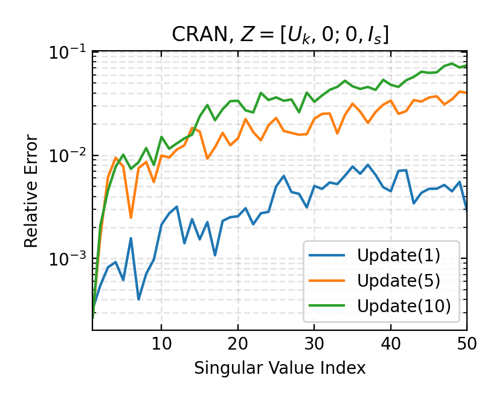
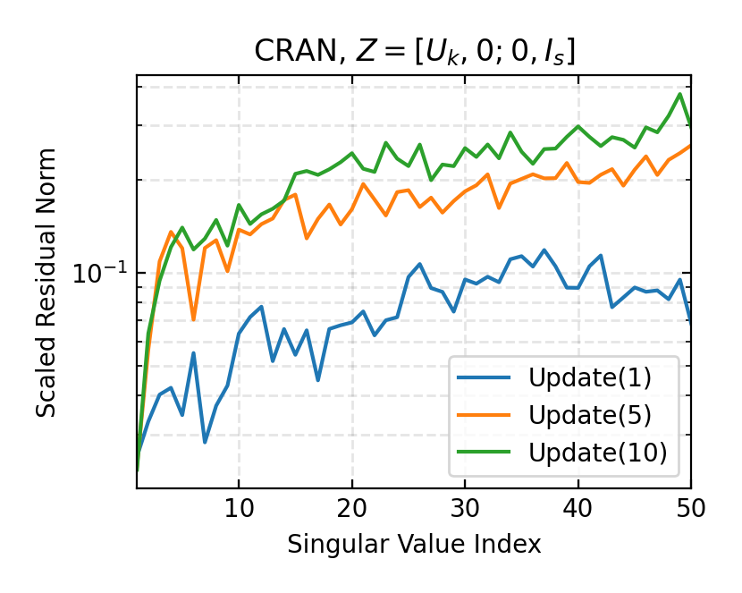
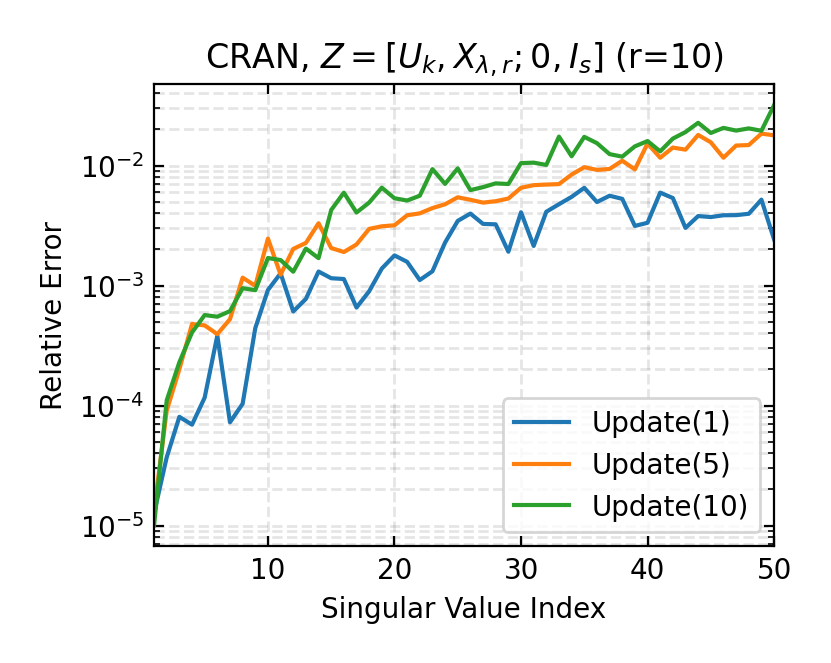
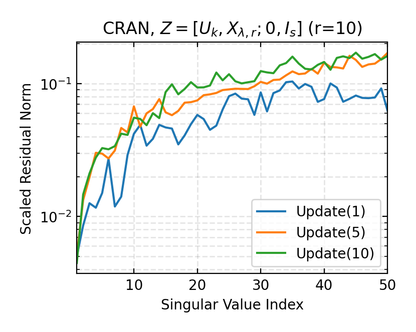
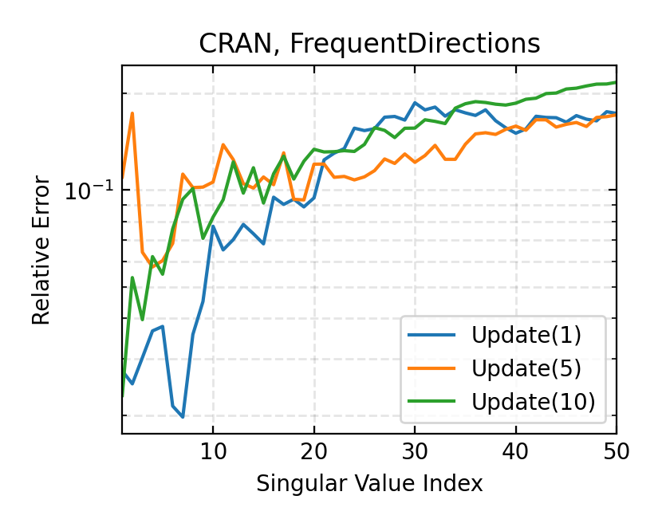
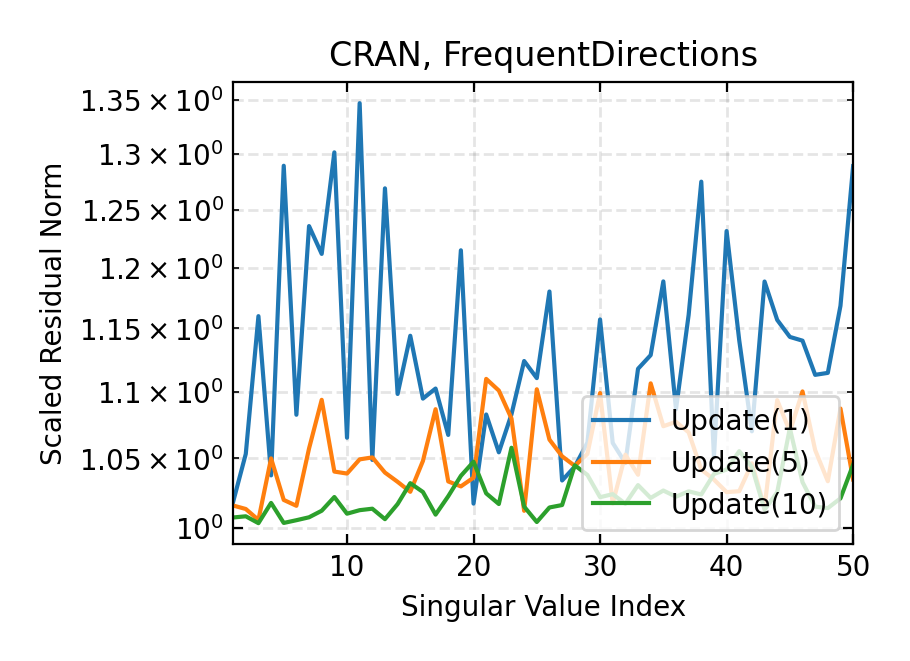

# ML Reproducibility Challenge 2021

This repository hosts documents and code for reproducing the algorithm for updating the truncated singular value decomposition (SVD) of evolving matrices outlined by Vassilis Kalantzis, Georgios Kollias, Shashanka Ubaru, Athanasios N. Nikolakopoulos, Lior Horesh, and Kenneth L. Clarkson in their paper [Projection techniques to update the truncated SVD of evolving matrices](http://proceedings.mlr.press/v139/kalantzis21a/kalantzis21a.pdf) published in the 38th International Conference on Machine Learning 2021. We (Andy Chen, Shion Matsumoto, and Rohan Sinha Varma) present this repository as part of a submission to the [ML Reproducibility Challenge 2021](https://paperswithcode.com/rc2021) along with our [report](report/ML_Reproducibility_Challenge_2021_Report.pdf).

## Introduction

### Problem Statement

In applications where the matrix is subject to the periodic addition of rows (and/or columns), re-calculating the SVD with each update can quickly become prohibitively expensive, particularly if the updates are frequent. For this reason, algorithms that exploit previously available information on the SVD of the matrix before the update to calculate the SVD of the update matrix are crucial. This can be in the context of both the full SVD and the rank-k SVD, the latter of which is the focus of our study.

<!---
The basic problem of updating the rank-$k$ truncated SVD of an updated matrix is as follows. Let $B\in\mathbb{C}^{m\times n}$ be a matrix for which a rank-$k$ SVD
$
B_k = U_k \Sigma_k V_k^T = \sum_{j=1}^k \sigma_j u^{(j)} (v^{(j)})^H
$
where $U_k=[u^{(1)},\dots,u^{(k)}]$, $V_k=[v^{(1)},\dots,v^{(k)}]$, and $\Sigma_k=\verb|diag|(\sigma_1,\dots,\sigma_k)$ where $\sigma_1 \geq \sigma_2 \geq\dots\geq \sigma_k > 0$ is known. Given a matrix to be appended (row-update scenario) $E\in\mathbb{C}^{s\times n}$ such that
$
A = \begin{pmatrix} B \\ E \end{pmatrix},
$
the goal is to approximate the rank-$k$ SVD
$A_k=\widehat{U}_k \widehat{\Sigma}_k \widehat{V}_k^H = \sum_{j=1}^k \widehat{\sigma}_j \widehat{u}^{(j)} (\widehat{v}^{(j)})^H$.
--->

### Algorithms

In our study, we use three algorithms to calculate the truncated SVD of evolving matrices:

1. Zha-Simon projection-based update algorithm (Algorithm 2.1)
2. Enhanced projection-based update algorithm (Algorithm 2.2)
3. [FrequentDirections](https://epubs.siam.org/doi/abs/10.1137/15M1009718?mobileUi=0)

Though we will not discuss the specifics of each of the algorithms we used, each experiment followed a similar structure. The basic structure is listed below

1. Evolve matrix by appending rowsaccording to the specified updating scheme
2. Calculate truncated SVD of updated matrix using desired update method
3. Calculate metrics for updated truncated SVD

### Evaluation

The performance of each algorithm is evaluated using three metrics:

1. Relative singular value error
2. Scaled residual norm singular triplet
3. Runtime

## How to Run Experiments

The following sections provide instructions on the installation in order to run the experiments as well as the datasets used in the study.

### Conda Environment Setup

The necessary dependencies are listed in the [`environment.yml`](environment.yml) file and can be used to set up a new [Anaconda](https://www.anaconda.com/) environment for running the experiments in this repository.

```bash
conda env create -n <env-name> -f environment.yml
conda activate <env-name>
```

### Datasets

The datasets have been converted into a convenient format and can be accessed [here](https://drive.google.com/drive/folders/1tHrUILY_NBKDPmNYOaEpWnc9-1US9DEB). Note that a few of the datasets had to be converted from a sparse into dense format.

### Running Experiments

The experimental parameters are specified in a JSON file as follows:

```json
{
  "tests": [
    {
      "dataset": "CRAN",
      "method": ["zha-simon", "bcg", "fd"],
      "m_percent": 0.1,
      "n_batches": [2, 6, 10],
      "phis_to_plot": [1, 5, 10],
      "k_dims": [25, 50, 75, 100, 125],
      "make_plots": true
    },
    {
      "dataset": "CISI",
      "method": ["zha-simon", "bcg", "fd"],
      "m_percent": 0.1,
      "n_batches": [2, 6, 10],
      "phis_to_plot": [1, 5, 10],
      "k_dims": [25, 50, 75, 100, 125],
      "make_plots": true
    }
  ],
  "dataset_info": {
    "CISI": "./datasets/CISI.npy",
    "CRAN": "./datasets/CRAN.npy",
    "MED": "./datasets/MED.npy",
    "ML1M": "./datasets/ML1M.npy",
    "Reuters": "./datasets/reuters.npy"
  },
  "method_label": {
    "bcg": "$Z = [U_k, X_{\\lambda,r}; 0, I_s]$",
    "zha-simon": "$Z = [U_k, 0; 0, I_s]$",
    "frequent-directions": "FrequentDirections"
  }
}
```

Below are tables listing parameters and their descriptions. Please see our JSON files in the experiments directory for complete examples.

| Parameter      | Description                                                 | Example                                 |
| -------------- | ----------------------------------------------------------- | --------------------------------------- |
| `tests`        | List of json objects describing tests                       | See table below                         |
| `dataset_info` | Name and location of datasets used in tests                 | `"CRAN": "./datasets/CRAN.npy"`         |
| `method_label` | JSON object containing labels used in plots for each method | `"zha-simon": "$Z = [U_k, 0; 0, I_s]$"` |

The `tests` parameter provides a list of json objects specifying all the tests to be run. Below we detail what these JSON objects must contain. Note if BCG is being run on any dataset, the BCG only parameters must be included

| Parameter      | Description                                  | Example                      |
| -------------- | -------------------------------------------- | ---------------------------- |
| `dataset`      | Name of dataset to run on                    | `"CRAN"`                     |
| `method`       | List of update methods to run                | `["zha-simon", "bcg", "fd"]` |
| `m_percent`    | Percent of data used as initial matrix       | `0.1`                        |
| `n_batches`    | Number of update batches                     | `[2, 6, 10]`                 |
| `phis_to_plot` | Batch numbers to plot                        | `[1, 5, 10]`                 |
| `k_dims`       | Rank of updates                              | `[25, 50, 75, 100]`          |
| `make_plots`   | Option to plot update results                | `true`                       |
| `r_values`     | Number of oversamples(BCG only)              | `[10, 20, 30, 40, 50]`       |
| `lam_coeff`    | Lambda Coefficient (BCG only)                | `1.01`                       |
| `num_runs`     | Number of runs for BCG experiment (BCG only) | `1`                          |

To run the experiment, all you have to do is call `run_tests.py` and specify the path to the JSON file and the directory to contain the cache folder where results and figures will be stored.
Additional plots can be created by using `make_runtime_plots.py` and specifying a JSON file specifying plot parameters and the cache location.

The parameters for the JSON file for the runtime plotting script are listed below. An example can be found in [`experiments/plot_spec.json`](experiments/plot_spec.json)

| Parameter      | Description                                                                                                                    | Example                                 |
| -------------- | ------------------------------------------------------------------------------------------------------------------------------ | --------------------------------------- |
| `n_batches`    | Set of 'number of update batches' values to generate runtime graphs over, plots will have runtime on y-axis and rank on x-axis | `[2,6,10]`                              |
| `ranks`        | Set of rank values to generate runtime graphs over, plots will have runtime on y-axis and rank on x-axis                       | `[25,50,75,100]`                        |
| `method_label` | JSON object containing labels used in plots for each method                                                                    | `"zha-simon": "$Z = [U_k, 0; 0, I_s]$"` |
| `datasets`     | List of strings containing names of datasets to generate plots for                                                             | `["CISI","CRAN","MED"]`                 |

```shell
# Navigate to truncatedSVD root directory
cd [...]/truncatedSVD

# If cache directory not specified, defaults to current directory
python run_tests.py -e <tests.json>

# Option to explicitly set cache directory
python run_tests.py -e <tests.json> -c <cache_directory>

# Make Runtime plots comparing methods for each specified dataset
python make_runtime_plots.py -c <cache_directory> -s <plot_params.json>
```

**Note:** Depending on the number of experiments, the cache can become large (~1 GB), so please ensure that your system has sufficient space before running the experiments.

## Results

In one of our experiments, we evaluated the Zha-Simon and enhanced projection variations of the proposed algorithm and FrequentDirections on the CRAN dataset with `n_batches=10`, `k_dims=50`, and `r=10`. Shown below are plots of the relative singular value errors and scaled residual norms of the first 50 singular triplets for the first, fifth, and tenth updates using the Zha-Simon projection-based update method (first line), enhanced projection-based update method (second line), and FrequentDirections (third line).

<p align = "center">
  
  
</p>

<p align = "center">
  
  

<p align = "center">
  
  

For our complete set of results, please refer to our [report](report/ML_Reproducibility_Challenge_2021_Report.pdf) and [supplementary materials](report/ML_Reproducibility_Challenge_2021_Supplementary.pdf).

## Team

Andy Chen, Shion Matsumoto, and Rohan Sinha Varma

## Acknowledgments

We would like to acknowledge Professor Laura Balzano for introducing us to this challenge and also for advising us on this project. We would also like to thank Professor Vassilis Kalantzis for providing us with the code used in producing their results.
